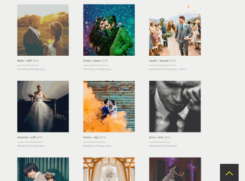

## backToTop.js



	
A simple back to top button that can be used in any webpages. 
	
	
### Features
- No dependencies
- Scrolls to top quickly and smoothly when user clicks.
	
	
### To use
It can load last after all web contents, therefore, add the below codes at the bottom of `<body>` section.  
```
<script type="text/javascript" src="js/backToTop.js"></script>
<script type="text/javascript">

	var goTop = new goTop({
		container: "totop",
		hoverBgColor: "tabIcon"	
	});

```	
	
	
#### Note
The demo picture is a screenshot from a website I developed during my studies. A disclaimer is stated at the bottom of the website.
	
	